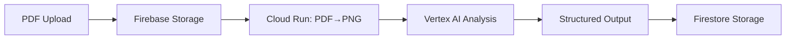
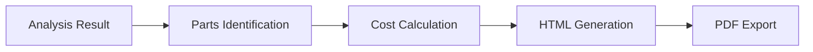

# KnockAI - Google Hackathon 2025 Entry 🚀

> **AI-Powered Blueprint Cost Estimation System**  
> Nuxt3 + Firebase + Google Vertex AI で構築された、図面解析・見積もり自動生成システム

---

## 🎯 プロジェクト概要

KnockAI は、建設・製造業界向けの AI 駆動型図面解析・コスト見積もりシステムです。PDF の図面をアップロードするだけで、Google Vertex AI が図面を解析し、部品リストと詳細な見積書を自動生成します。
[](https://youtu.be/oi97GbeGuiQ)

> **🚀 [デモ動画を見る](https://youtu.be/oi97GbeGuiQ)**

### 🌟 主要機能

- 📄 **PDF 図面の自動解析** - Google Vertex AI による高精度な図面読み取り
- 💰 **自動見積もり生成** - 部品識別から価格計算まで完全自動化
- 🔄 **リアルタイム処理** - Cloud Run マイクロサービスによる高速処理
- 📊 **プロダクションシミュレーション** - 在庫・生産計画の最適化
- 🎨 **モダン UI** - NuxtUI による美しく直感的なインターフェース

---

## 🏗️ システムアーキテクチャ

### 技術スタック

```
Frontend:     Nuxt3 (SSR無効) + Vue3 + TypeScript
UI Framework: NuxtUI Pro + TailwindCSS
State:        Pinia (Composition API style)
Backend:      Firebase (Firestore/Auth/Functions/Storage)
AI Engine:    Google Vertex AI (Gemini 2.0 Flash)
Microservices: Cloud Run (Python)
Type Safety:  Zod + Custom TypeConverter
Monitoring:   Datadog RUM/Logs
```

### 🎯 アーキテクチャ図

```
┌─────────────────┐    ┌──────────────────┐    ┌─────────────────┐
│   Frontend      │    │    Firebase      │    │   Cloud Run     │
│   (Nuxt3)       │───▶│   (Firestore)    │───▶│ (AI Processing) │
│                 │    │   (Auth/Storage) │    │                 │
└─────────────────┘    └──────────────────┘    └─────────────────┘
         │                        │                        │
         │                        ▼                        ▼
         │              ┌──────────────────┐    ┌─────────────────┐
         └─────────────▶│  Google Vertex   │    │   PDF→PNG       │
                        │      AI          │    │   Converter     │
                        │  (Gemini 2.0)    │    │                 │
                        └──────────────────┘    └─────────────────┘
```

---

## 📁 プロジェクト構造

```
knockai/
├── 🎨 Frontend (Nuxt3)
│   ├── components/           # UIコンポーネント
│   │   ├── ui/              # カスタムExxxxコンポーネント
│   │   ├── blueprint/       # 図面関連コンポーネント
│   │   ├── simulation/      # シミュレーション機能
│   │   └── Admin/           # 管理画面
│   ├── composables/         # ビジネスロジック
│   │   ├── firestore-doc-operation.ts
│   │   ├── firebase-storage-operations.ts
│   │   └── csv.ts
│   ├── stores/              # Piniaストア
│   │   ├── blueprint.ts     # 図面管理
│   │   ├── firebase-ai-logic.ts
│   │   └── admin-user.ts
│   ├── types/models/        # Zodスキーマ
│   │   ├── blueprint.ts
│   │   ├── firestoreTypeConverter.ts
│   │   └── *.ts
│   ├── utils/               # ユーティリティ
│   ├── pages/               # ルーティング
│   └── plugins/             # Firebase初期化等
│
├── 🐍 Backend Services
│   ├── cloudRun/            # Cloud Runマイクロサービス
│   │   ├── convertPdfToPngAndCapture/
│   │   └── createEstimationDocument/
│   ├── google-adk/          # Google ADK Agents
│   │   └── firestore_test_connect/
│   └── backend/             # Python補助スクリプト
│
└── 🔧 Configuration
    ├── firebase.json        # Firebase設定
    ├── nuxt.config.ts       # Nuxt設定
    ├── firestore.rules      # セキュリティルール
    └── package.json         # 依存関係
```

---

## 🎯 主要機能フロー

### 1. 図面アップロード & 解析



### 2. 見積もり生成



---

## 🛡️ 開発ガイドライン

### 型安全性の確保

- **必須**: Firestore 操作時は Zod + TypeConverter 使用
- **推奨**: 全ての外部データに Zod バリデーション適用

### コンポーネント命名規則

- **NuxtUI 拡張**: `Exxxx`プレフィックス（例: `EButton`, `EModal`）
- **機能別**: `blueprint/`, `simulation/`等のディレクトリ分割

### エラーハンドリング

- グローバルエラーモーダルで統一表示
- Nuxt Error Boundary による包括的エラー捕捉

---

## 📚 技術詳細

### Firebase 設定

- **Firestore**: メインデータストア（組織・図面・見積もり）
- **Authentication**: メール/Google/Microsoft SSO
- **Storage**: PDF/PNG/JSON ファイル保存
- **Functions**: バックエンドロジック

### AI 処理パイプライン

1. **PDF 解析**: Google Vertex AI (Gemini 2.0 Flash)
2. **構造化出力**: Zod スキーマによる型安全な結果
3. **部品識別**: カスタム AI エージェント
4. **価格計算**: 部品データベースとの照合

### パフォーマンス最適化

- **SSR 無効**: SPA として高速化
- **コード分割**: 動的インポートによる最適化
- **Firebase Emulator**: ローカル開発の高速化

---

## 📄 ライセンス

このプロジェクトは Google Hackathon 2025 のエントリー作品です。

---

**🎉 Google Hackathon 2025 Entry - Built with ❤️ using Nuxt3 + Firebase + Google AI**
